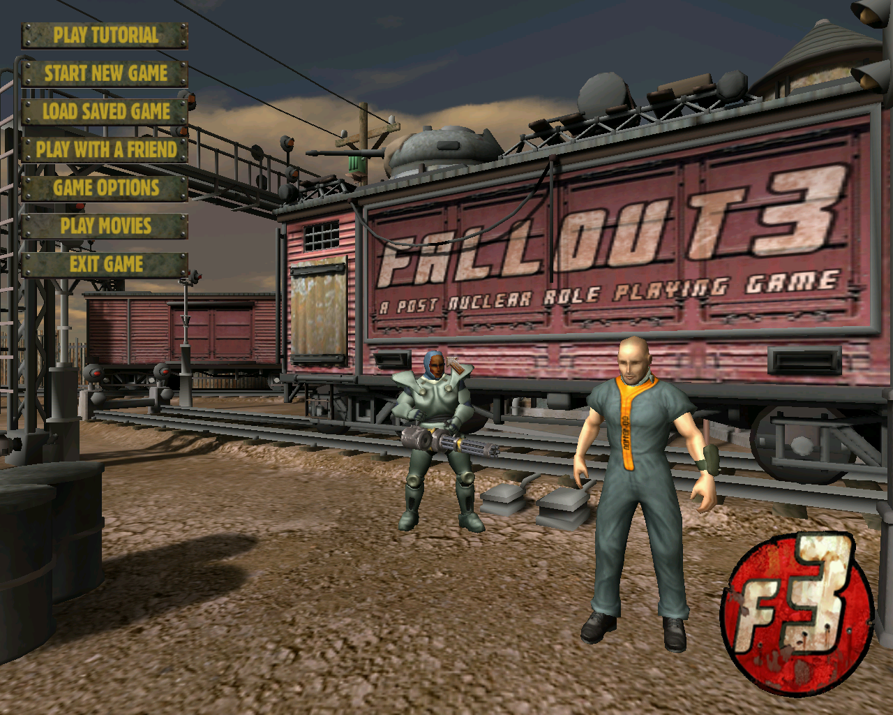

# Van Buren Explorer

A Windows File-like Explorer tool to view and export the contents of files from the lost Fallout 3 game, code named "Van Buren", created by Black Isle Studios.

## Table of Contents

- [Overview](#overview)
- [Installation](#installation)
- [License](#license)
- [Links](#links)

## Overview

Van Buren was the project name Black Isle Studios assigned to their version of Fallout 3. The game was going to use an engine that Black Isle had made for Baldur's Gate 3, commonly referred to as the Jefferson Engine. In 2003, the game was canceled due to financial difficulties.

A tech demo of Van Buren was created during the game's development. While the tech demo was not the finished game, it demonstrated the basic interface, gameplay, and interactions the final game might have had. The tech demo did however come with a set of files including textures, meshes, sounds, and text used to display in the demo.

Van Buren Explore is a labour of love and was created to decrypt and view information stored in these files. 

The tech demo can be downloaded from the [Mod DB](https://www.moddb.com/) site [here](https://www.moddb.com/games/van-buren/downloads/van-buren-tech-demo).

## Features

* View contents of .GRP files from the Van Buren tech demo
* Export (most) file formats (see below for the current list of supported ones)

## File Formats

This is a list of the file formats Van Buren Explorer supports for exporting and viewing

* TGA (24/32 bit, compressed and uncompressed)
* BMP
* INI (text)

## Installation

* TODO

## Usage

1. Launch the applicaton from wherever you have downloaded or built it
2. Click on the "..." icon in the toolbar to launch the folder browser
3. Locate the folder where you have your copy of Van Buren installed to
4. Enjoy!

## Repository

This repository uses the Gitflow workflow model. All production releases are done on the master branch. The develop branch is the latest and greatest version. New PRs must be done in new branches against the develop branch.

## How to Contribute

1. Clone the develop branch of this repository and create a new branch: `$ git checkout https://github.com/bsimser/Van-Buren-Explorer -b name_for_new_branch`
2. Make changes and test
3. Submit a Pull Request with a description of your changes

## Support

* Twitter at [@bsimser](https://twitter.com/bsimser)

## License

Van Buren Explorer is licensed under the [MIT license](http://opensource.org/licenses/mit-license.php) and is available for free.

## Links

* [Issue Tracker](https://github.com/bsimser/Van-Buren-Explorer/issues)
* [Source code](https://github.com/bsimser/Van-Buren-Explorer)

